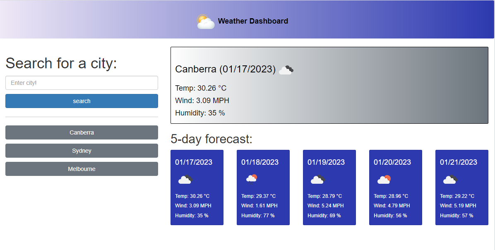

# weather-dashboard

Jisha Bhat's five-day weather dashboard.

## Purpose

To build a weather dashboard that will run in the browser and feature dynamically updated HTML and CSS.

## User Story

```
AS A traveler
I WANT to see the weather outlook for multiple cities
SO THAT I can plan a trip accordingly
```

## Acceptance Criteria

```
GIVEN a weather dashboard with form inputs
WHEN I search for a city
THEN I am presented with current and future conditions for that city and that city is added to the search history
WHEN I view current weather conditions for that city
THEN I am presented with the city name, the date, an icon representation of weather conditions, the temperature, the humidity, and the wind speed
WHEN I view future weather conditions for that city
THEN I am presented with a 5-day forecast that displays the date, an icon representation of weather conditions, the temperature, the wind speed, and the humidity
WHEN I click on a city in the search history
THEN I am again presented with current and future conditions for that city
```


## Usage

* Enter a city into the text input
* Click 'search' to search for the city
* If the city is invalid nothing will happen
* Otherwise, the city will be saved. A new city button will be created
* Saved cities will be saved to local storage
* The weather dashboard will be updated to display the five day forecast for the new city.
* Reloading the page will cause the first stored cities weather to be displayed.
* For each day, the date, temperature, wind speed, humidity, and weather icon will be displayed.
* Deployment - [Weather dashboard](https://bhatj.github.io/weather-dashboard/)
* 